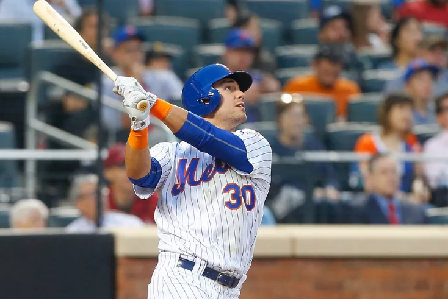

# Empirical Bayesian Estimation of batting averages

A bunch of simulations showing the robustness and efficacy of using a beta-binomial model to estimate probability of getting a hit in a given at-bat.
Starring future Mets icon and Oregon State alumni Michael Conforto

